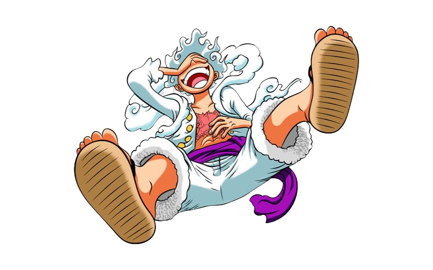

# 🏴‍☠️ ONE PIECE API 

A TypeScript React application for exploring the world of One Piece, built as a learning project to master modern web development technologies.

  

## 🎯 Learning Goals

- **TypeScript**: Strengthening type-safe development practices
- **React**: Building dynamic and interactive user interfaces
- **Next.js**: Mastering full-stack React framework with SSR and SSG
- **Supabase**: Implementing backend services and database management

## 🛠️ Tech Stack

  
  
  
  

- **Frontend**: React + TypeScript + Next.js
- **Backend**: Supabase  
- **Database**: PostgreSQL (via Supabase)

## 📖 Project Overview

This project serves as a One Piece API where users can explore information about characters, crews, devil fruits, and adventures from the One Piece universe. The goal is to create a comprehensive database and interface while learning the fundamentals of full-stack development with modern tools including Next.js for server-side rendering and optimized performance.

## 🚀 Getting Started

This project is currently in development as part of my TypeScript, React, and Next.js learning journey.

  

---

*Set sail and explore the Grand Line of web development!* ⛵

